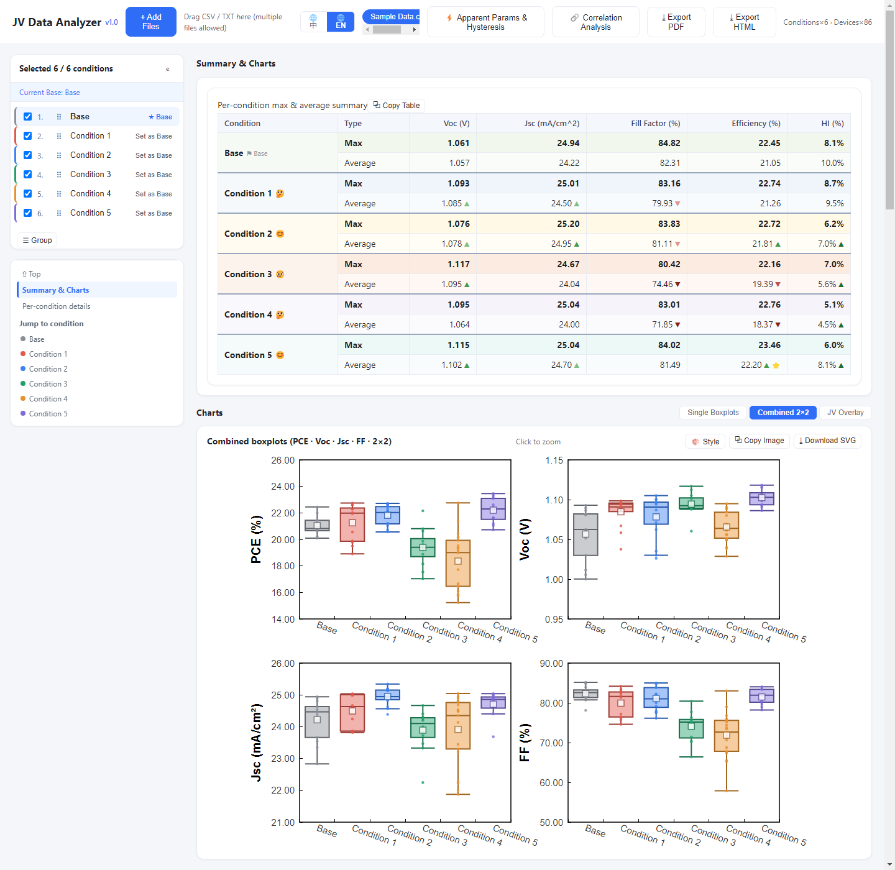
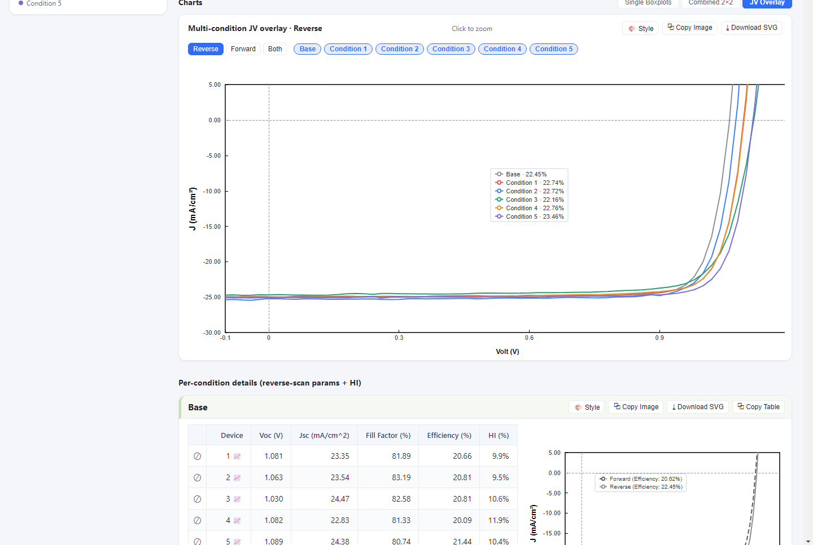
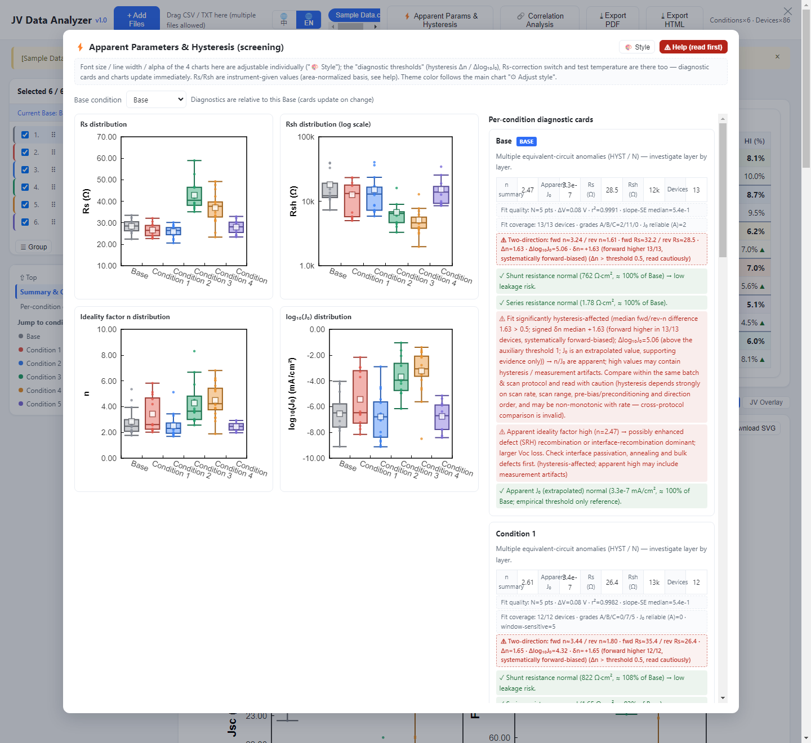
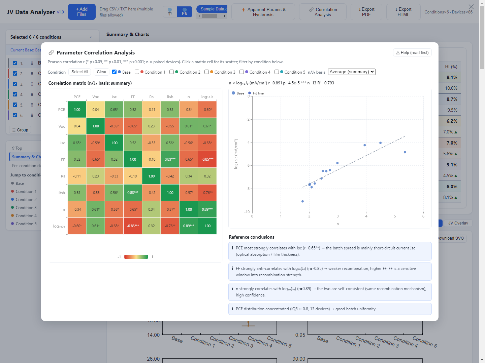

# JV Data Analysis Tool

English | [简体中文](README.md)

An offline analysis tool for perovskite solar cell J–V data. Load the CSV/TXT files exported by your test system, and it sorts devices by condition, computes Voc, Jsc, FF, PCE and the hysteresis index (HI), then gives you summary tables, Origin-style box plots, J–V curves of the best device in each condition, apparent-parameter hysteresis diagnostics, and a parameter correlation matrix.

Pure front end, one HTML file, fully offline — your data never leaves the machine.



## Why this exists

The analysis modules that ship with test systems are fine for looking at a single curve. The moment you want to **compare conditions in batch** — forward vs. reverse scan, hysteresis, which process condition wins — you end up exporting everything and re-processing it in Origin or Python, doing the same clicks every time.

This tool collapses that loop into a single file: open the page, drop in your data, and the tables and plots are there. The box plots follow Origin's conventions on purpose, so they drop into a group-meeting deck without re-styling.

## What it does

Drop in your data and the tool groups devices by condition, computes the best and average values plus the hysteresis index (HI) per condition, and fills the summary table — copy it straight into your report.

- Box plots of PCE / Voc / Jsc / FF in Origin style (box, median, whiskers, raw points, mean), as individual plots, a 2×2 grid, or a multi-condition J–V overlay
- J–V curves of the best device per condition, forward and reverse, auto-focused on the fourth quadrant
- Hysteresis diagnostics: apparent Rs, Rsh, n and J₀ extracted from the curves, with per-condition distribution plots and diagnostic cards, compared by scan direction. These are engineering screening metrics, not intrinsic parameters — definitions and thresholds live in the in-app help
- Correlation analysis: an 8×8 Pearson matrix heatmap; click any cell to see the scatter
- Export: PNG, SVG, print-ready PDF, or a self-contained HTML that reopens with your data and layout intact
- Encoding is detected on import (GBK exports from Windows instruments won't garble), and the UI switches between English and Chinese — your condition names and data are never translated



The hysteresis diagnostics view: parameter distributions on the left, per-condition diagnostic cards on the right, all read against the Base condition.





## Getting started

Open the [Releases](releases/latest) page, download `JV Data Analysis Tool v1.1.html`, and double-click it — no Python, no cloning. The release asset is identical to what the build script produces from source.

1. Drag your instrument's CSV/TXT files onto the page (or click "Add file"). If you just want to look around first, the repo ships a sample at `v1.0/样例数据/Sample Data.csv` — real measurement data with condition names anonymized to Condition 1–5 plus a Base. If a "merge suggestion" dialog pops up (the sample uses series-style condition names), just choose "keep all"
2. Tick the conditions to compare in the left panel; rename them or set one as Base
3. Switch views at the top: individual, combined, or J–V overlay
4. Export from the card buttons, or the toolbar (PDF / HTML)

Building from source is covered below; the result is identical to the release asset.

## Data format compatibility

Two formats are recognized; both are plain-text exports from test software (CSV or tab-separated TXT).

**Format A — raw instrument export.** Recognized field names (case-insensitive):

| Field | Meaning |
|---|---|
| `[Volt (V)]` `[Current (mA)]` `[J (mA/cm^2)]` | J–V curve columns |
| `[Information]` | start-of-device marker |
| `Area (cm^2)` | device area |
| `Reverse data` | reverse-scan flag (True/False) |
| `Step (V)` `Delay (ms)` | scan step and delay |
| `Temperature (degC)` `Light Intensity (SUN)` | temperature and illumination |

These field names match the export format of **Enlitech IVS-series software**, verified against the author's own measurements (SS-X solar simulator).

**Format B — processed CSV**: a tidy table with header `Device | Voc (V) | Jsc (mA/cm^2) | Fill Factor (%) | Efficiency (%) | HI`.

> **Other vendors' formats**: if your columns can be mapped onto the field names above, it should just work. Formats with different column names or unusual separators (Keithley and Newport LabVIEW exports, for example) need to be reshaped into format A or B first. Only these two formats have been adapted and tested so far — everything else is **unverified**. If your format doesn't parse, open an issue with a (sanitized) sample and I'll try to add support.

## Naming recommendations (name interpreter)

The tool decomposes exported names along three dimensions — **condition / channel / direction** — for automatic regrouping and recognition. The more consistent the naming, the more accurate the auto-parse and preview:

| Dimension | Meaning | Recommended style |
|---|---|---|
| **Condition** | experiment key (recipe / batch label) | short names such as `R1`, `Sample-A`, `BASE`; avoid embedding channel numbers |
| **Channel** | device / repeat slot within a condition | `CH_Ref(1)`, `CH_Ref(2)` … (incrementing) |
| **Direction** | forward / reverse scan | `Forward` / `Reverse` (or `F`/`R`) |

**Common naming examples**:

| Example | Parsed as | Notes |
|---|---|---|
| `R1-1.CH_Ref(1)` … `R1-1.CH_Ref(4)` | condition `R1-1`, 4 channels | most common CH_Ref style |
| `1.CH_Ref.Reverse(1)` | condition `1`, direction word kept | Reverse/Forward auto-detected |
| `Sample-A 1 (X.CH_Ref(1))` | condition `Sample-A 1`, channel in parentheses | nested parentheses supported |
| `PVK-1 Device 3` | condition `PVK-1` | Device-block naming |
| `Base-15%MACl` / `Condition 1` | single condition | grouped as-is (no channel slot) |

Since v1.1 no regex knowledge is needed: when a naming difference is detected on import the tool only shows a light 2-second toast (no interruption), and the **🧩 Condition Grouping** button in the toolbar is always there:

- Auto groups: names are clustered into cards — "Merge" a whole group when it looks right, "Details" to inspect members, "Exclude" the ones you don't want
- Manual board: box-select, click-select, search; select several cards and "Group into one". Made a mistake? "↺ Undo (N)" steps back one at a time
- Block editing: every name is split into colored blocks (condition / channel / direction / ignored); click a block to reassign it and the preview refreshes instantly. On a merged card you can also "⛓ Split" it back apart, or remove a single member from the member list
- Apply & remember: "Apply" takes effect on the current data immediately; tick "Save rule" and the same naming style is auto-applied on the next import. A single high-confidence template regroups silently without any dialog
- The old "👁 Name Rules" regex entry has been removed (previously saved rules still apply)

Files with 60+ conditions stay manageable: cards come in compact/normal density, one scrollbar keeps everything scannable, and names in the same group share a color. See [name interpreter internals](docs/name-interpreter.md).

> Note: condition/device names are user data — the tool only decomposes and regroups them by template; it never translates or normalizes them.

## Building from source

Repository layout:

```
v1.0/
  index.html          page skeleton
  style.css           styles
  js/                 logic modules (parsing, statistics, charts, UI, i18n)
  lib/echarts.min.js  ECharts 5.5, the only third-party dependency, bundled inline
  build_single.py     single-file build script
  样例数据/            sample data for demo (condition names anonymized)
```

Build the single-file release (Python 3):

```bash
cd v1.0
python build_single.py
```

The output, `JV Data Analysis Tool v1.1.html`, has all CSS/JS/ECharts inlined — copy it anywhere and it works.

## License

MIT, see [LICENSE](LICENSE).

If something doesn't work — a format it won't parse, a plot you'd like to see, a number that looks wrong — open an issue, ideally with a sanitized sample attached.
