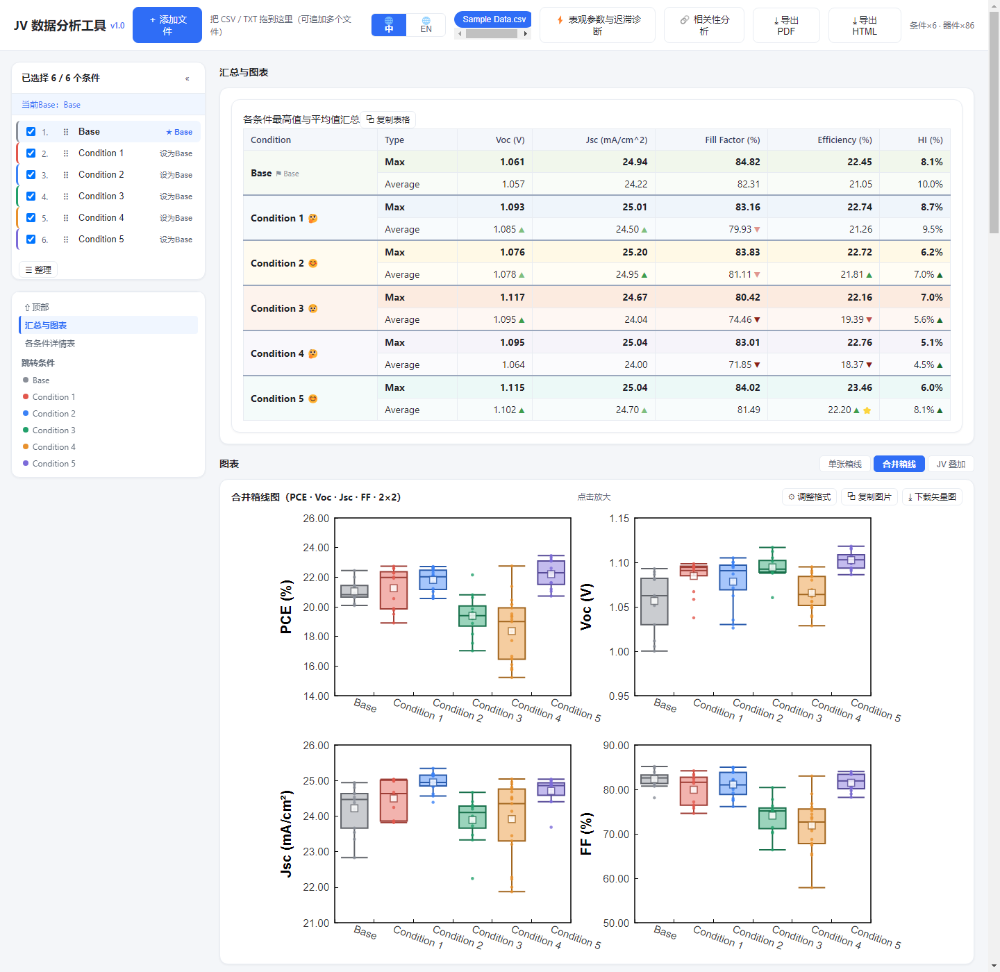
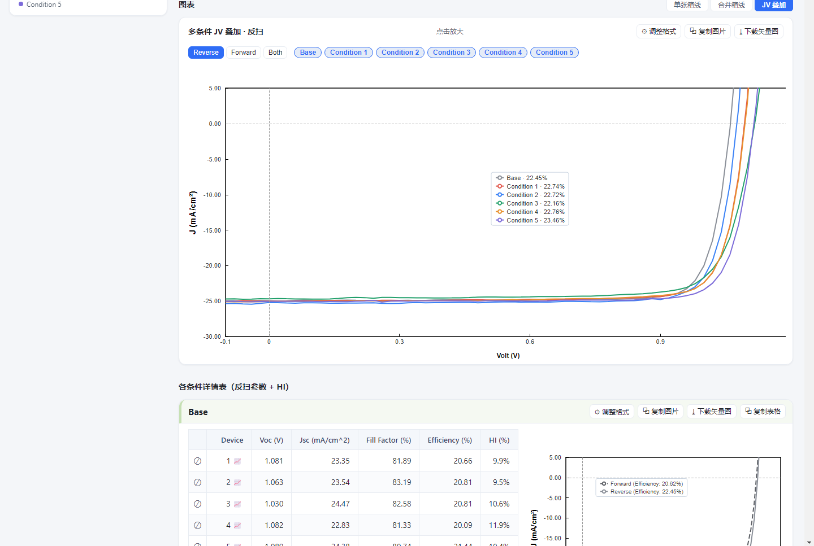
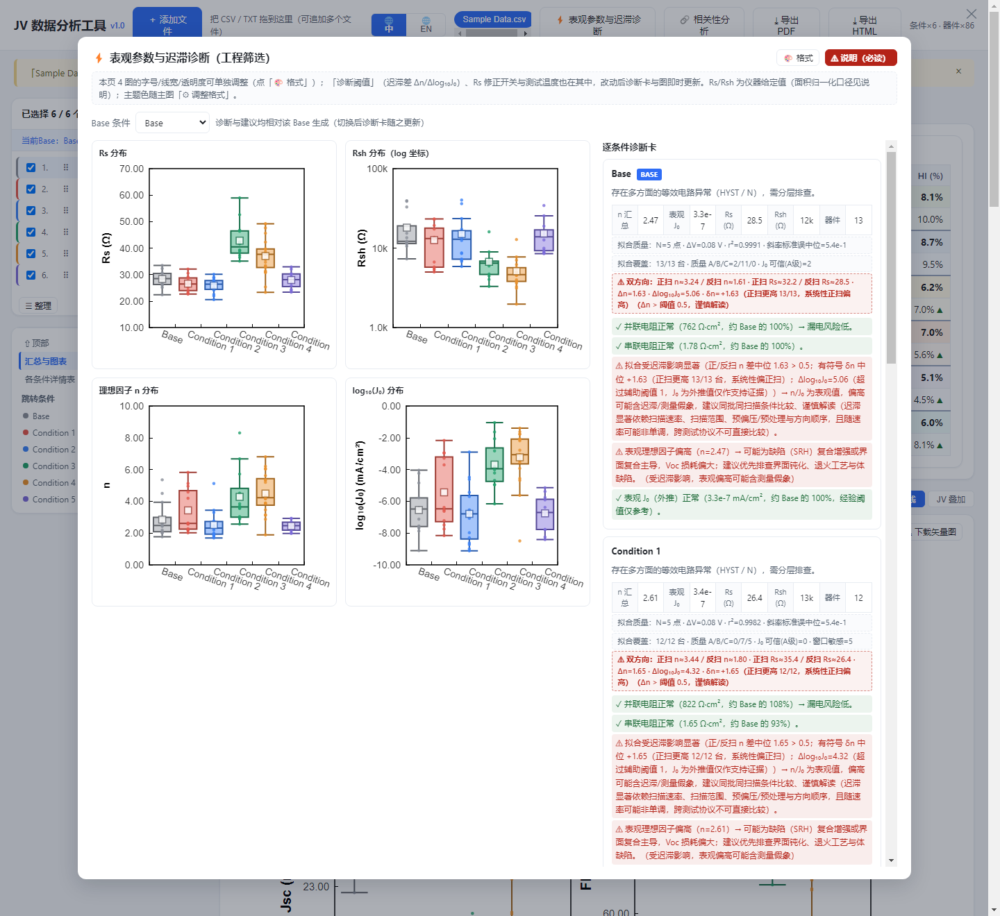
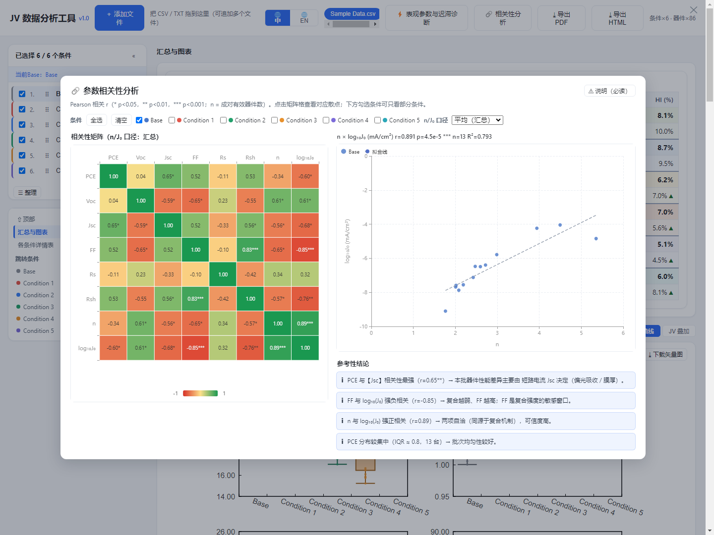

# JV 数据分析工具

[English](README.en.md) | 简体中文

钙钛矿太阳能电池 JV 数据的离线分析工具：导入测试系统导出的 CSV/TXT，自动整理各条件器件的 Voc、Jsc、FF、PCE、HI，输出汇总表、Origin 风格的箱线图、最高器件 JV 曲线，还能做迟滞诊断和参数相关性分析。

纯前端，就一个 HTML 文件，双击就能用，全程不联网——数据不出你的电脑。



## 为什么做这个

实验室常用的测试软件（尤其是仪器自带的分析模块）看单条曲线很方便，但要做**条件间批量对比**——正反扫、迟滞、不同工艺条件谁高谁低——就得把数据导出来，用 Origin 或 Python 重新处理，中间不少重复劳动。

这个工具把这一步压缩成一个文件：打开页面，拖入数据，图表和表格就有了。图表风格按 Origin 的箱线图画法做了对齐，贴到组会 PPT 里不用再调。

## 能做什么

拖入数据后，工具自动按条件分组，算出每个条件的最高器件值、平均值和 HI（迟滞指数），汇总表可以直接复制走。

- 箱线图：PCE / Voc / Jsc / FF 四个参数，箱体、中位线、须线、原始点、均值都按 Origin 的画法来，有单张、2×2 合并、多条件 JV 叠加三种视图
- JV 曲线：每个条件最高器件的正反扫，第四象限自动聚焦
- 迟滞诊断：从 JV 曲线提取表观 Rs、Rsh、n、J₀，按条件出分布图和诊断卡，正反扫分开比较。口径和阈值在工具内帮助页有说明——这是工程筛选指标，不是本征参数
- 相关性分析：8×8 参数相关性矩阵，点哪个格就画哪组散点
- 导出：图片 PNG、矢量 SVG、PDF 报告、自包含 HTML（重新打开还能恢复数据和图表，适合留档）
- 导入时编码自动识别，Windows 仪器导出的 GBK 不会乱码；界面中英双语，右上角切换，条件名、文件名这些你的数据不参与翻译



迟滞诊断界面：左边四张参数分布图，右边逐条件诊断卡，都相对 Base 给出参考意见。





## 下载与使用

打开 [Releases](releases/latest) 页面，下载 `JV Data Analysis Tool v1.1.html`，双击就能用，不用装 Python 也不用 clone 源码。Releases 里的文件和源码构建出的产物完全一致。

1. 打开页面，把仪器导出的 CSV/TXT 拖进去（或点「添加文件」）。第一次用可以先拖仓库里的样例数据 `v1.0/样例数据/Sample Data.csv`（真实测量数据的脱敏版：条件名已匿名化为 Condition 1~5 加一个 Base）。如果弹出「条件合并建议」是因为样例条件名是同名系列命名，选「全部保持」即可
2. 左侧勾选要对比的条件，可以改名、设 Base 基准
3. 上方切视图：单张箱线、合并箱线、JV 叠加
4. 导出走图表卡片上的按钮，或顶栏的「导出 PDF / 导出 HTML」

想从源码构建的话见下节，产物和 Releases 一样。

## 数据格式兼容性

工具识别两种格式，都是测试软件导出的文本文件（CSV 或制表符分隔的 TXT）：

**格式 A —— 仪器原始导出**。识别的字段名如下（不区分大小写）：

| 字段 | 含义 |
|---|---|
| `[Volt (V)]` `[Current (mA)]` `[J (mA/cm^2)]` | JV 曲线三列 |
| `[Information]` | 每个器件块起始标记 |
| `Area (cm^2)` | 器件面积 |
| `Reverse data` | 反扫标记（True/False） |
| `Step (V)` `Delay (ms)` | 扫描步长与延迟 |
| `Temperature (degC)` `Light Intensity (SUN)` | 温度与光强 |

这套字段名对应**光焱科技（Enlitech）IVS 系列软件**的导出格式，作者自己的实测数据（SS-X 系列太阳模拟器）用此格式验证过。

**格式 B —— 处理后的 CSV**：表头为 `Device | Voc (V) | Jsc (mA/cm^2) | Fill Factor (%) | Efficiency (%) | HI` 的整理表。

> **其他厂家的导出格式**：只要列名能对上上面这些字段名，就能直接用；列名不同或分隔符特殊的（比如 Keithley、Newport 用 LabVIEW 导出的变体格式），需要先手动排成格式 A 或 B。工具目前只在这两种格式上做了适配和测试，其他格式**尚未验证**——欢迎带上样例数据提 issue，我会尽量加适配。

## 命名建议（名称解释器）

工具会按「条件 / 通道 / 方向」三个维度分解仪器导出的名称，用于自动归并与识别。命名越规范，自动解析与预览越准确：

| 维度 | 含义 | 推荐写法 |
|---|---|---|
| **条件** | 实验主键（配方/批次标签） | 简单短名，如 `R1`、`Sample-A`、`BASE`；避免含通道档数字 |
| **通道** | 同条件下的器件/重复测量档位 | `CH_Ref(1)`、`CH_Ref(2)` …（数字递推） |
| **方向** | 正扫 / 反扫 | `Forward` / `Reverse`（或缩写 `F`/`R`） |

**常见命名示例对照**：

| 示例 | 解析结果 | 说明 |
|---|---|---|
| `R1-1.CH_Ref(1)` … `R1-1.CH_Ref(4)` | 条件 `R1-1`，4 个通道 | CH_Ref 系最常用 |
| `1.CH_Ref.Reverse(1)` | 条件 `1`，含方向词 | Reverse/Forward 自动识别 |
| `Sample-A 1 (X.CH_Ref(1))` | 条件 `Sample-A 1`，括号内通道 | 括号嵌套也可识别 |
| `PVK-1 Device 3` | 条件 `PVK-1` | Device 块命名 |
| `Base-15%MACl` / `Condition 1` | 单条件 | 无通道档，按原文归组 |

工具（v1.1+）不用写正则：导入时检测到命名差异只轻提示一下（2 秒 toast，不打扰），之后随时点工具栏「🧩 条件分组」：

- 自动分组：名字按模式归组成卡，确认无误的整组「归并」，拿不准的点「详情」看成员，不想要的「排除」
- 手动画板：框选、点选、搜索，选中多张卡「归为一组」；做错了「↺ 撤销（N）」逐步回退
- 块级微调：每个名字拆成彩色积木（条件 / 通道 / 方向 / 忽略），点积木改角色，预览即时刷新；合并卡上还能「⛓ 拆分」拆回，或从成员清单里单独移出某条
- 应用与记忆：「应用」立即对当前数据生效；勾选「保存规则」后，下次导入同款命名自动应用；高置信单模板则静默归并，全程不打扰
- 旧「👁 名称规则」正则入口已移除（曾保存的规则仍然生效）

60+ 条件的文件也不用怕：卡片有紧凑/常规密度切换，单滚动条一屏可扫，同组名字按颜色区分。详见 [名称解释器原理](docs/name-interpreter.md)。

> 提示：条件名/器件名是用户数据，工具只按模板分解与归并，**不做翻译与规整**。

## 从源码构建

仓库结构：

```
v1.0/
  index.html          页面骨架
  style.css           样式
  js/                 逻辑模块（解析、统计、图表、UI、i18n）
  lib/echarts.min.js  ECharts 5.5（唯一第三方依赖，本地内联）
  build_single.py     单文件打包脚本
  样例数据/            脱敏样例数据（演示用，条件名已匿名化）
```

打包单文件（需要 Python 3）：

```bash
cd v1.0
python build_single.py
```

产物为 `JV Data Analysis Tool v1.1.html`——CSS/JS/ECharts 全部内联，拷走就能用。

## 许可

MIT License，见 [LICENSE](LICENSE)。

用下来哪里不顺手——格式不认、图不好看、数值存疑——都欢迎提 issue，最好带上脱敏后的数据样例。
